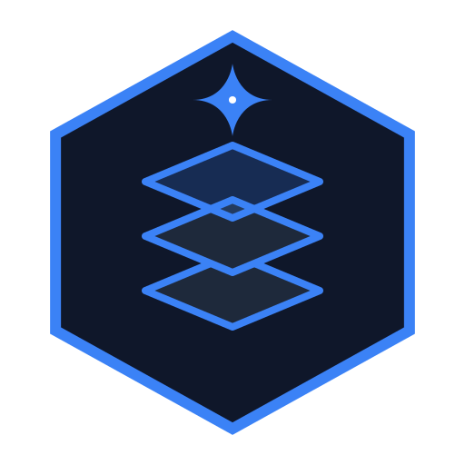

<div align="center">
  

  # StackAlchemist

  **The Intelligent Software Architect**

  [](LICENSE)
  [](#%EF%B8%8F-tech-stack)
  [](#-the-compile-guarantee)

  *StackAlchemist transmutes natural language into deployable SaaS architectures. We guarantee zero hallucinations by automatically executing a strict CI/CD build check before delivering a fully customized, production-ready backend.*
</div>

---

## ⚠️ License Notice & Commercial Use

StackAlchemist is a **Proprietary & Source Available** platform. The source code is publicly visible to guarantee architectural transparency, but commercial distribution is strictly governed.

- **For Personal Use & Evaluation:** You are free to fork, explore, and run the engine locally for non-commercial purposes.
- **For Commercial Production:** You must purchase a tier from [StackAlchemist.app](https://stackalchemist.app) to legally use the generated infrastructure in a production environment.

Please review the full [LICENSE](LICENSE) agreement before cloning.

---

## 🚀 Enterprise Features

The platform is designed to bypass the traditional "boilerplate" phase of software development, saving engineering teams hundreds of billable hours per project.

- **The "Swiss Cheese" Engine:** We do not rely on open-ended LLM agents that hallucinate folder structures. We utilize a highly-opinionated template library, injecting AI-generated business logic (C# Controllers, Dapper Queries) into rigid, deterministic Handlebars templates.
- **The Compile Guarantee:** Every generated repository is physically reconstructed in a secure LXC container and subjected to a rigorous `dotnet build` and `npm run build` process. If it doesn't compile, it doesn't ship.
- **Dual Mode Intake:** Teams can utilize "Simple Mode" for rapid AI-first prototyping or "Advanced Mode" for granular, manual schema definition.
- **Infrastructure as Code (IaC):** Tier 3 generates custom AWS CDK scripts, Docker Compose files, **Helm Charts**, and automated deployment runbooks alongside the application code.

---

## 🛠️ Core Technology Stack

StackAlchemist is built using modern, highly-scalable primitives.

- **Frontend & Gateway:** Next.js 15 (App Router), Tailwind CSS, shadcn/ui.
- **Generation Engine:** .NET 10 Web API, Handlebars.Net.
- **Database & Identity:** Supabase PostgreSQL (Strict RLS enabled).
- **Intelligence Layer:** Claude 3.5 Sonnet (via Anthropic API or BYOK).
- **Storage & Delivery:** Cloudflare R2 (Zero Egress).

---

## 📂 System Architecture

The repository is modularized into distinct operational layers:

```text
StackAlchemist/
├── src/
│   ├── StackAlchemist.Web/       # User Intake UI & Orchestration API Gateway
│   ├── StackAlchemist.Engine/    # The Core "Swiss Cheese" Parsing & Reconstruction Service
│   ├── StackAlchemist.Worker/    # Background CLI Execution (The Compile Guarantee)
│   └── StackAlchemist.Templates/ # Master structural boilerplates (V1: .NET/Next.js)
├── docs/                         # Comprehensive engineering and product documentation
└── .github/                      # Enterprise governance and contribution workflows
```

---

## 📖 Official Documentation

Detailed specifications and runbooks are available in the `/docs` directory.

### For Engineering & DevOps
- [Software Design Document](docs/architecture/Software%20Design%20Document.md)
- [Dev Environment Setup](docs/architecture/Dev%20Environment%20Setup.md)
- [Data Flow Diagram (Mermaid)](docs/architecture/Data%20Flow%20Diagram.md)
- [System Sequence Diagram](docs/architecture/Sequence%20Diagram.md)
- [Database ERD](docs/architecture/Database%20ERD.md)
- [Generation State Machine](docs/architecture/Generation%20State%20Machine.md)

### For Product & Business
- [Business Requirements Document (BRD)](docs/product/Business%20Requirements%20Document.md)
- [Product Requirements Document (PRD)](docs/product/Product%20Requirements%20Document.md)
- [Product Use Cases](docs/product/Use%20Cases.md)
- [UI/UX Wireframes](docs/product/wireframes.md)

### For End-Users
- [Platform User Guide](docs/user/user-guide.md)
- [Troubleshooting & FAQ](docs/user/troubleshooting.md)

---

## 🤝 Governance & Contributions

We welcome feedback and non-commercial community contributions to our template libraries. Please see our [Contributing Guide](.github/CONTRIBUTING.md) for details on our strict SOLID/DRY coding standards and the process for submitting pull requests.

<div align="center">
  <sub>Built by StackAlchemist. All rights reserved.</sub>
</div>
