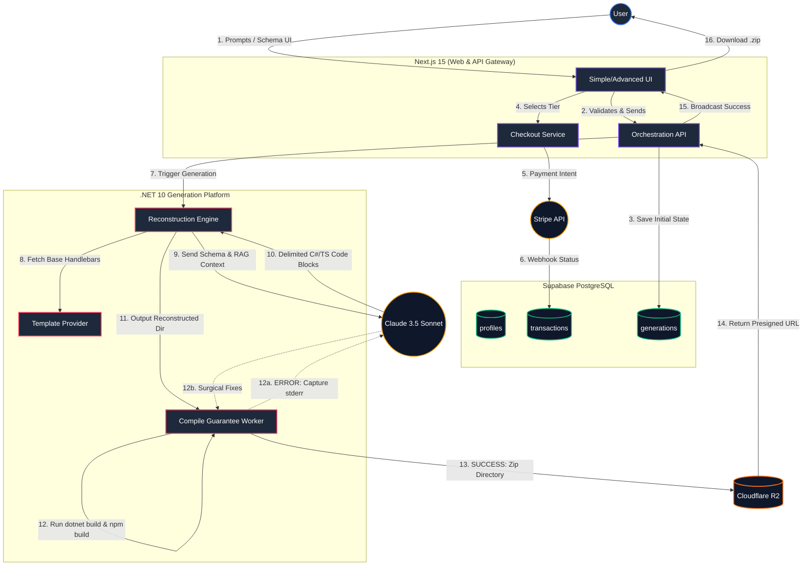

# StackAlchemist: Architecture & Data Flow Diagram

### Flow Breakdown
1. **Intake:** The user submits a prompt or visual schema via the Next.js UI.
2. **Checkout:** The user selects a tier. Stripe processes the payment and a webhook updates the Supabase `transactions` table.
3. **Generation:** The .NET Engine loads static Master Templates, sends the database schema to Claude 3.5, and receives delimited code blocks in return.
4. **Reconstruction:** The engine merges the static Handlebars templates with the dynamic LLM code and writes it to a temporary directory.
5. **Compile Guarantee:** The worker executes CLI build commands. If it fails, it loops back to Claude for automated fixes.
6. **Delivery:** Upon a successful exit code (0), the directory is zipped, uploaded to Cloudflare R2, and a presigned URL is streamed back to the user via WebSockets.
