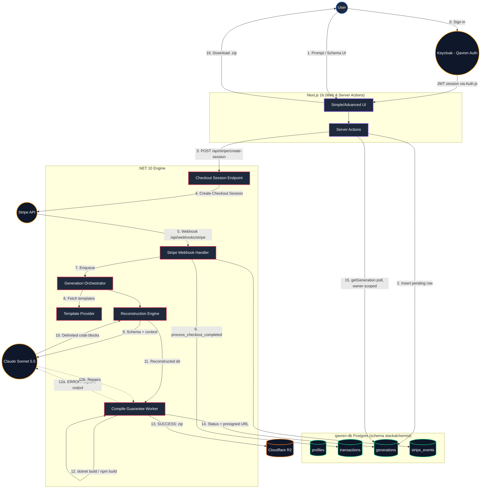

# StackAlchemist: Architecture & Data Flow Diagram

> Updated 2026-10-03. Data lives in qavren-db (Postgres); there is no Supabase, WebSocket or Realtime path in the live system.

```mermaid
graph TD
    %% Styling
    classDef user fill:#1E293B,stroke:#3B82F6,stroke-width:2px,color:#fff;
    classDef gateway fill:#1E293B,stroke:#8B5CF6,stroke-width:2px,color:#fff;
    classDef db fill:#0F172A,stroke:#10B981,stroke-width:2px,color:#fff;
    classDef engine fill:#1E293B,stroke:#F43F5E,stroke-width:2px,color:#fff;
    classDef external fill:#0F172A,stroke:#F59E0B,stroke-width:2px,color:#fff;
    classDef storage fill:#0F172A,stroke:#F97316,stroke-width:2px,color:#fff;

    %% Entities
    User((User)):::user
    Stripe((Stripe API)):::external
    Claude((Claude Sonnet 5.5)):::external
    Keycloak((Keycloak - Qavren Auth)):::external

    %% Next.js Gateway
    subgraph Frontend ["Next.js 16 (Web & Server Actions)"]
        UI[Simple/Advanced UI]:::gateway
        Actions[Server Actions]:::gateway
    end

    %% Database
    subgraph PG ["qavren-db Postgres (schema stackalchemist)"]
        Profiles[(profiles)]:::db
        Transactions[(transactions)]:::db
        Generations[(generations)]:::db
        Events[(stripe_events)]:::db
    end

    %% Core Engine
    subgraph Backend [".NET 10 Engine"]
        Checkout[Checkout Session Endpoint]:::engine
        Webhook[Stripe Webhook Handler]:::engine
        Orchestrator[Generation Orchestrator]:::engine
        Templates[Template Provider]:::engine
        Reconstruction[Reconstruction Engine]:::engine
        Worker[Compile Guarantee Worker]:::engine
    end

    %% Storage
    R2[(Cloudflare R2)]:::storage

    %% Auth
    User -->|0. Sign in| Keycloak
    Keycloak -->|JWT session via Auth.js| UI

    %% Intake
    User -->|1. Prompt / Schema UI| UI
    UI --> Actions
    Actions -->|2. Insert pending row| Generations

    %% Payment Flow
    Actions -->|3. POST /api/stripe/create-session| Checkout
    Checkout -->|4. Create Checkout Session| Stripe
    Stripe -->|5. Webhook /api/webhooks/stripe| Webhook
    Webhook -->|6. process_checkout_completed| Transactions
    Webhook --> Events
    Webhook -->|7. Enqueue| Orchestrator

    %% Generation Flow
    Orchestrator -->|8. Fetch templates| Templates
    Orchestrator --> Reconstruction
    Reconstruction -->|9. Schema + context| Claude
    Claude -->|10. Delimited code blocks| Reconstruction

    %% Compile Guarantee Flow
    Reconstruction -->|11. Reconstructed dir| Worker
    Worker -->|12. dotnet build / npm build| Worker
    Worker -.->|12a. ERROR: capture output| Claude
    Claude -.->|12b. Repairs| Worker

    %% Delivery Flow
    Worker -->|13. SUCCESS: zip| R2
    Worker -->|14. Status + presigned URL| Generations

    %% Status by polling
    Actions -->|15. getGeneration poll, owner-scoped| Generations
    UI -->|16. Download .zip| User
```

### Flow Breakdown
1. **Intake:** the user signs in through Keycloak, then submits a prompt or visual schema in the Next.js UI. Server Actions insert a `pending` generation row owned by the session user.
2. **Checkout:** for paid tiers, a Server Action asks the Engine to create the Stripe Checkout session. Stripe posts the signed `checkout.session.completed` webhook to the Engine, which runs `process_checkout_completed` (idempotency event, tier update, transaction upsert in one transaction) and enqueues the build. Spark (Tier 0) skips payment: the action posts to the Engine's `/api/generate` directly.
3. **Generation:** the Engine loads the template set, sends the schema to Claude, and receives delimited code blocks.
4. **Reconstruction:** the Engine merges the template with the generated code in a temporary directory.
5. **Compile Guarantee:** the worker runs the real build. On failure it loops back to Claude for repairs, up to 3 times. A paid build that still fails is refunded automatically.
6. **Delivery:** on success the directory is zipped, uploaded to Cloudflare R2, and the presigned URL is written to the generation row. The status page picks it up by polling `getGeneration` every 3 s while the tab is visible. Spark builds store `preview_files_json` instead of a ZIP.
