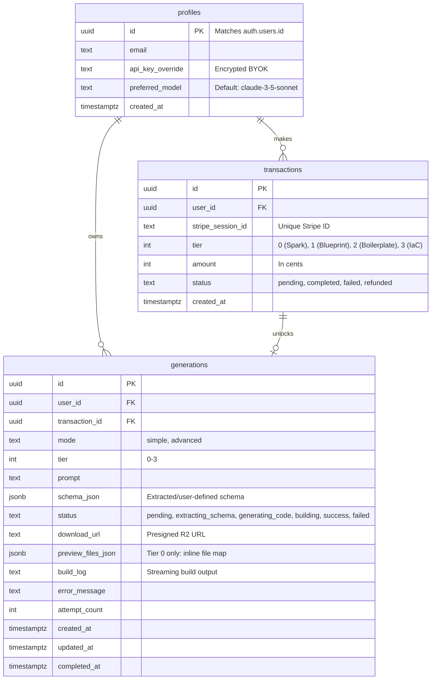

# StackAlchemist: Database ERD

> **Status (2026-04-04):** Migration SQL files checked in at `supabase/migrations/`. Schema matches the TypeScript types in `src/StackAlchemist.Web/src/lib/types.ts`. RLS policies and Realtime publication are included.

This diagram illustrates the core relational structure within the Supabase PostgreSQL database.

## RLS Policies

| Table | Policy | Rule |
|-------|--------|------|
| `profiles` | Users read/update own | `auth.uid() = id` |
| `transactions` | Users read own | `auth.uid() = user_id` |
| `transactions` | Service role manages | `auth.role() = 'service_role'` |
| `generations` | Anyone can insert | `true` (supports unauthenticated free tier) |
| `generations` | Anyone can read | `true` (supports Realtime subscriptions by ID) |
| `generations` | Service role updates | `auth.role() = 'service_role'` |

## Realtime

`generations` table is added to `supabase_realtime` publication for live status streaming to the frontend.
