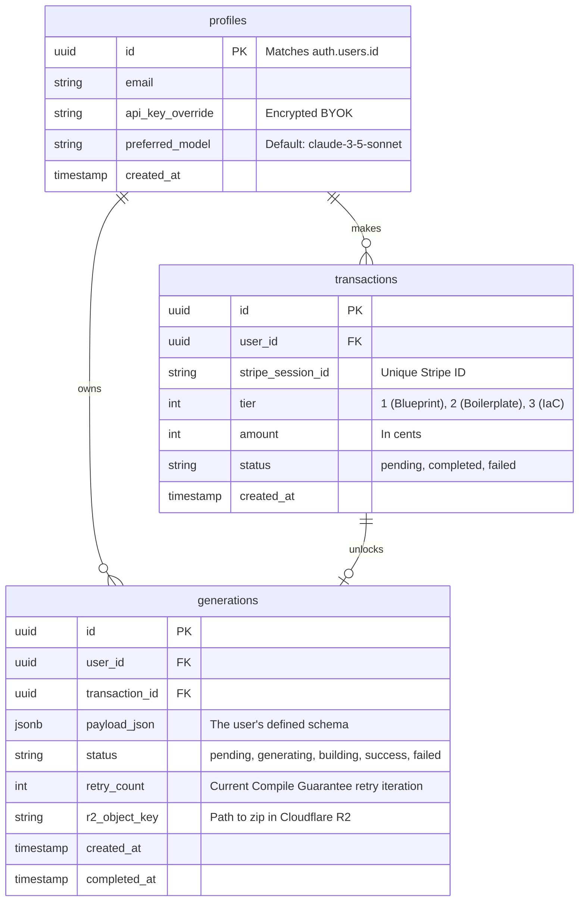

# StackAlchemist: Database ERD

This diagram illustrates the core relational structure within the Supabase PostgreSQL database.

```mermaid
erDiagram
    %% Entities
    profiles {
        uuid id PK "Matches auth.users.id"
        string email
        string api_key_override "Encrypted BYOK"
        string preferred_model "Default: claude-3-5-sonnet"
        timestamp created_at
    }

    transactions {
        uuid id PK
        uuid user_id FK
        string stripe_session_id "Unique Stripe ID"
        int tier "1 (Blueprint), 2 (Boilerplate), 3 (IaC)"
        int amount "In cents"
        string status "pending, completed, failed"
        timestamp created_at
    }

    generations {
        uuid id PK
        uuid user_id FK
        uuid transaction_id FK
        jsonb payload_json "The user's defined schema"
        string status "pending, generating, building, success, failed"
        int retry_count "Current Compile Guarantee retry iteration"
        string r2_object_key "Path to zip in Cloudflare R2"
        timestamp created_at
        timestamp completed_at
    }

    %% Relationships
    profiles ||--o{ transactions : "makes"
    profiles ||--o{ generations : "owns"
    transactions ||--o| generations : "unlocks"
```
