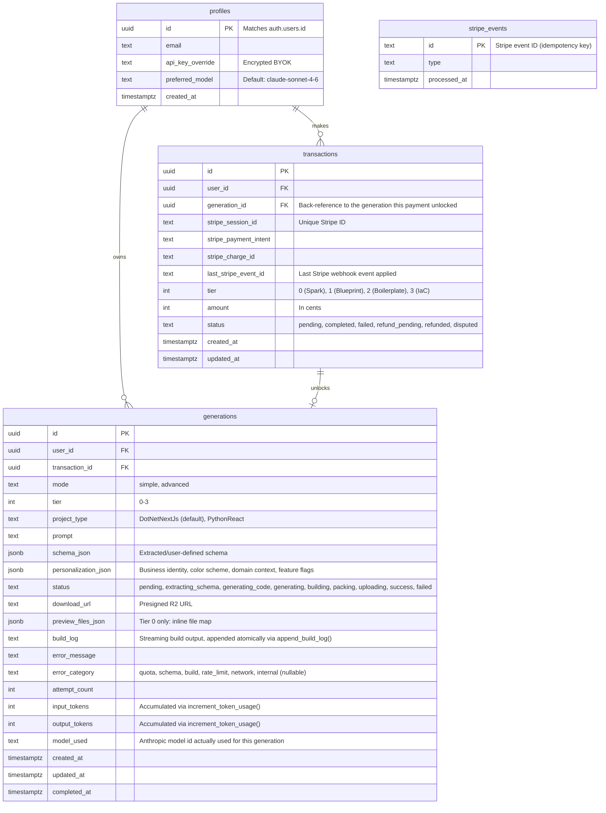

# StackAlchemist: Database ERD

> **Status (2026-07-05):** Regenerated from every migration in `supabase/migrations/` through `20260705000001_add_transaction_refund_pending_status.sql`. Schema matches the TypeScript types in `src/StackAlchemist.Web/src/lib/types.ts`. RLS policies and Realtime publication are included.

This diagram illustrates the core relational structure within the Supabase PostgreSQL database.

```mermaid
erDiagram
    %% Entities
    profiles {
        uuid id PK "Matches auth.users.id"
        text email
        text api_key_override "Encrypted BYOK"
        text preferred_model "Default: claude-sonnet-4-6"
        timestamptz created_at
    }

    transactions {
        uuid id PK
        uuid user_id FK
        uuid generation_id FK "Back-reference to the generation this payment unlocked"
        text stripe_session_id "Unique Stripe ID"
        text stripe_payment_intent
        text stripe_charge_id
        text last_stripe_event_id "Last Stripe webhook event applied"
        int tier "0 (Spark), 1 (Blueprint), 2 (Boilerplate), 3 (IaC)"
        int amount "In cents"
        text status "pending, completed, failed, refund_pending, refunded, disputed"
        timestamptz created_at
        timestamptz updated_at
    }

    generations {
        uuid id PK
        uuid user_id FK
        uuid transaction_id FK
        text mode "simple, advanced"
        int tier "0-3"
        text project_type "DotNetNextJs (default), PythonReact"
        text prompt
        jsonb schema_json "Extracted/user-defined schema"
        jsonb personalization_json "Business identity, color scheme, domain context, feature flags"
        text status "pending, extracting_schema, generating_code, generating, building, packing, uploading, success, failed"
        text download_url "Presigned R2 URL"
        jsonb preview_files_json "Tier 0 only: inline file map"
        text build_log "Streaming build output, appended atomically via append_build_log()"
        text error_message
        text error_category "quota, schema, build, rate_limit, network, internal (nullable)"
        int attempt_count
        int input_tokens "Accumulated via increment_token_usage()"
        int output_tokens "Accumulated via increment_token_usage()"
        text model_used "Anthropic model id actually used for this generation"
        timestamptz created_at
        timestamptz updated_at
        timestamptz completed_at
    }

    stripe_events {
        text id PK "Stripe event ID (idempotency key)"
        text type
        timestamptz processed_at
    }

    %% Relationships
    profiles ||--o{ transactions : "makes"
    profiles ||--o{ generations : "owns"
    transactions ||--o| generations : "unlocks"
```

`transactions.generation_id` is a second, back-pointing FK to `generations` (added alongside `generations.transaction_id`) so the webhook RPC can resolve either direction without an extra lookup.

## RLS Policies

| Table | Policy | Rule |
|-------|--------|------|
| `profiles` | Users read/update own | `auth.uid() = id` |
| `transactions` | Users read own | `auth.uid() = user_id` |
| `transactions` | Service role manages | `auth.role() = 'service_role'` |
| `generations` | Authenticated users insert own | `auth.uid() = user_id`, `to authenticated` (anon inserts blocked since 2026-05-30) |
| `generations` | Users read own generations | `auth.uid() = user_id`, `to authenticated` (owner-only since 2026-07-04; `anon` has no SELECT policy — see below) |
| `generations` | Service role updates | `auth.role() = 'service_role'` |
| `stripe_events` | Service role manages | `auth.role() = 'service_role'` |

A `before insert` trigger (`enforce_free_generation_quota`) additionally caps Tier 0 (Spark) generations at 5 per account per calendar month; it fires for every writer, including `service_role`, so it cannot be bypassed at the application layer.

Until 2026-07-04, `generations` had a permissive `using (true)` SELECT policy, so any holder of the public anon key could enumerate every row via PostgREST (`GET /rest/v1/generations?select=*`), including `download_url` (a presigned R2 URL) and prompt/schema content. It was replaced with the owner-only policy above; the `/generate/[id]` status page, the `/dashboard` list, and both Realtime subscriptions all read through `service_role` server actions or a signed-in user's own JWT, so no read path relied on the permissive policy.

## Realtime

`generations` table is added to `supabase_realtime` publication for live status streaming to the frontend.

## Supporting RPCs

- `append_build_log(gen_id, chunk)` — atomic build-log concatenation (replaces a fetch-append-patch race). `SECURITY DEFINER`, `service_role`-only execute, `search_path` pinned since 2026-07-04.
- `increment_token_usage(gen_id, input_delta, output_delta, model_name)` — atomic token-usage accumulation. Same `service_role`-only/`search_path`-pinned hardening as above.
- `process_checkout_completed(...)` — single transaction for the Stripe `checkout.session.completed` webhook: records the idempotency event, updates the generation's tier, and upserts the transaction row together.
