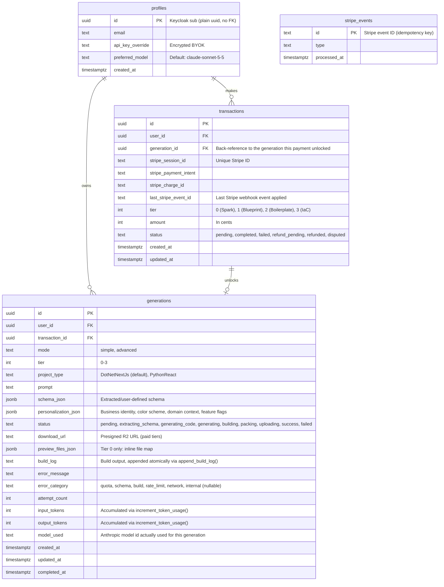

# StackAlchemist: Database ERD

> **Status (2026-10-03):** Regenerated from the Drizzle schema (`src/StackAlchemist.Web/src/db/schema.ts`) and the SQL in `src/StackAlchemist.Web/drizzle/` (`0000_init.sql`, `0001_functions.sql`). The database is qavren-db, the shared Qavren Postgres, schema `stackalchemist`, owned by its own role. Supabase is legacy/rollback-only and is being removed in phase F.

There is no RLS and no Realtime publication. Isolation is enforced in application code (see [Isolation](#isolation)).

```mermaid
erDiagram
    %% Entities
    profiles {
        uuid id PK "Keycloak sub (plain uuid, no FK)"
        text email
        text api_key_override "Encrypted BYOK"
        text preferred_model "Default: claude-sonnet-5-5"
        timestamptz created_at
    }

    transactions {
        uuid id PK
        uuid user_id FK
        uuid generation_id FK "Back-reference to the generation this payment unlocked"
        text stripe_session_id "Unique Stripe ID"
        text stripe_payment_intent
        text stripe_charge_id
        text last_stripe_event_id "Last Stripe webhook event applied"
        int tier "0 (Spark), 1 (Blueprint), 2 (Boilerplate), 3 (IaC)"
        int amount "In cents"
        text status "pending, completed, failed, refund_pending, refunded, disputed"
        timestamptz created_at
        timestamptz updated_at
    }

    generations {
        uuid id PK
        uuid user_id FK
        uuid transaction_id FK
        text mode "simple, advanced"
        int tier "0-3"
        text project_type "DotNetNextJs (default), PythonReact"
        text prompt
        jsonb schema_json "Extracted/user-defined schema"
        jsonb personalization_json "Business identity, color scheme, domain context, feature flags"
        text status "pending, extracting_schema, generating_code, generating, building, packing, uploading, success, failed"
        text download_url "Presigned R2 URL (paid tiers)"
        jsonb preview_files_json "Tier 0 only: inline file map"
        text build_log "Build output, appended atomically via append_build_log()"
        text error_message
        text error_category "quota, schema, build, rate_limit, network, internal (nullable)"
        int attempt_count
        int input_tokens "Accumulated via increment_token_usage()"
        int output_tokens "Accumulated via increment_token_usage()"
        text model_used "Anthropic model id actually used for this generation"
        timestamptz created_at
        timestamptz updated_at
        timestamptz completed_at
    }

    stripe_events {
        text id PK "Stripe event ID (idempotency key)"
        text type
        timestamptz processed_at
    }

    %% Relationships
    profiles ||--o{ transactions : "makes"
    profiles ||--o{ generations : "owns"
    transactions ||--o| generations : "unlocks"
```

`transactions.generation_id` is a second, back-pointing FK to `generations` (added alongside `generations.transaction_id`) so the webhook RPC can resolve either direction without an extra lookup.

## Isolation

There is no RLS. Every query that reads or writes user data is owner-scoped in code: the Web `DrizzleStore` filters on `user_id = <session user>`, and the Engine's Npgsql stores (`PostgresDeliveryService`, `PostgresBillingStore`) act on a generation id handed to them by an authenticated service call (`X-Engine-Key`). A caller asking for another user's row gets the same answer as for an unknown id (`null`).

The rule is proven by a two-user integration suite, `src/StackAlchemist.Web/__tests__/data/drizzle-store.integration.test.ts`. It runs against real Postgres when `TEST_DATABASE_URL` is set (skipped otherwise), seeds two profiles (alice, bob), and asserts that list and stats are scoped to the caller, that `getGenerationForUser` is owner-only, and that retry cannot flip another user's failed row. CI runs it on Postgres 17 (and nightly through the qavren-db pooler).

FKs from `generations.user_id` and `transactions.user_id` to `profiles.id` use `ON DELETE SET NULL`. A first-seen user needs `ensureProfile` before their first generation insert.

## Triggers

- `enforce_free_generation_quota` (before insert on `generations`) caps Tier 0 (Spark) at 5 builds per account per UTC calendar month. Failed builds do not count. Tier 0 rows with no `user_id` are rejected. It fires for every writer, so it cannot be bypassed at the application layer.
- `set_updated_at` (before update on `generations`) maintains `updated_at`.

## Supporting functions

- `append_build_log(gen_id, chunk)`: atomic build-log concatenation (avoids a fetch-append-write race).
- `increment_token_usage(gen_id, input_delta, output_delta, model_name)`: atomic token-usage accumulation.
- `process_checkout_completed(...)`: single transaction for the Stripe `checkout.session.completed` webhook. Records the idempotency event, updates the generation's tier, and upserts the transaction row together.

## Migrations

Generated by `drizzle-kit generate` into `src/StackAlchemist.Web/drizzle/` and applied by the `db:migrate` script. Prod applies them in the migrate step of `deploy-prod.yml` using `DATABASE_URL_MIGRATE`. See `docs/runbooks/qavren-db-migrations.md`.
