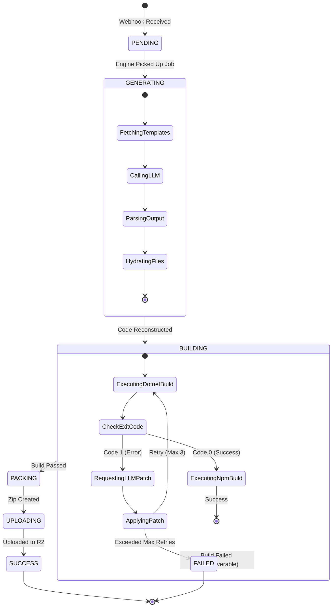

# StackAlchemist: Generation State Machine

This diagram defines the strict states a generation job can exist in, ensuring UI loading bars and background workers stay perfectly in sync.

```mermaid
stateDiagram-v2
    [*] --> PENDING : Webhook Received
    
    PENDING --> GENERATING : Engine Picked Up Job
    
    state GENERATING {
        [*] --> FetchingTemplates
        FetchingTemplates --> CallingLLM
        CallingLLM --> ParsingOutput
        ParsingOutput --> HydratingFiles
        HydratingFiles --> [*]
    }
    
    GENERATING --> BUILDING : Code Reconstructed
    
    state BUILDING {
        [*] --> ExecutingDotnetBuild
        ExecutingDotnetBuild --> CheckExitCode
        
        CheckExitCode --> ExecutingNpmBuild : Code 0 (Success)
        CheckExitCode --> RequestingLLMPatch : Code 1 (Error)
        
        RequestingLLMPatch --> ApplyingPatch
        ApplyingPatch --> ExecutingDotnetBuild : Retry (Max 3)
        ApplyingPatch --> FAILED : Exceeded Max Retries
        
        ExecutingNpmBuild --> [*] : Success
    }
    
    BUILDING --> PACKING : Build Passed
    BUILDING --> FAILED : Build Failed (Unrecoverable)
    
    PACKING --> UPLOADING : Zip Created
    UPLOADING --> SUCCESS : Uploaded to R2
    
    SUCCESS --> [*]
    FAILED --> [*]
```
