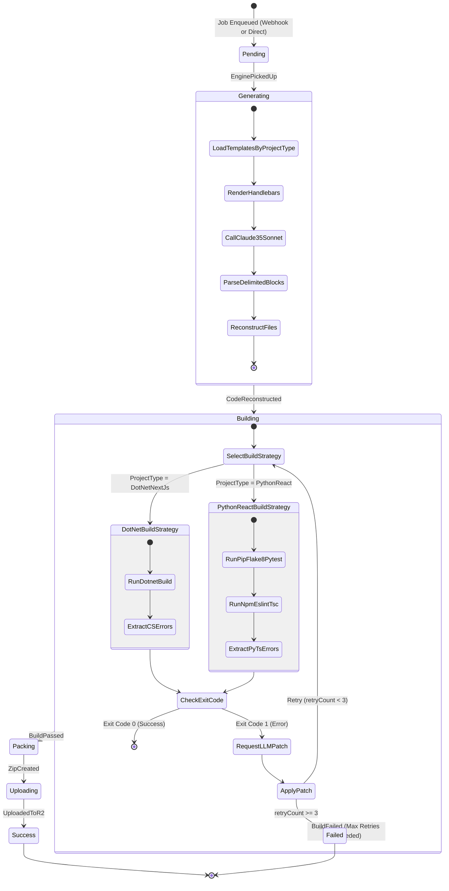

# StackAlchemist: Generation State Machine

This diagram defines the strict states a generation job can exist in, ensuring UI loading bars and background workers stay perfectly in sync.

### Implementation Reference

The state machine is implemented in `src/StackAlchemist.Engine/Services/GenerationStateMachine.cs` as a static transition table with special handling for the `BuildFailed` event (retry vs. terminal failure based on `GenerationContext.RetryCount`).

**States** (`GenerationState` enum): `Pending`, `Generating`, `Building`, `Packing`, `Uploading`, `Success`, `Failed`

**Events** (`GenerationEvent` enum): `EnginePickedUp`, `CodeReconstructed`, `BuildPassed`, `BuildFailed`, `ZipCreated`, `UploadedToR2`

**Build Strategy Selection**: The `CompileService` selects between `DotNetBuildStrategy` and `PythonReactBuildStrategy` based on the `ProjectType` field in `GenerationContext`. Both strategies plug into the same retry loop in `CompileWorkerService`.
