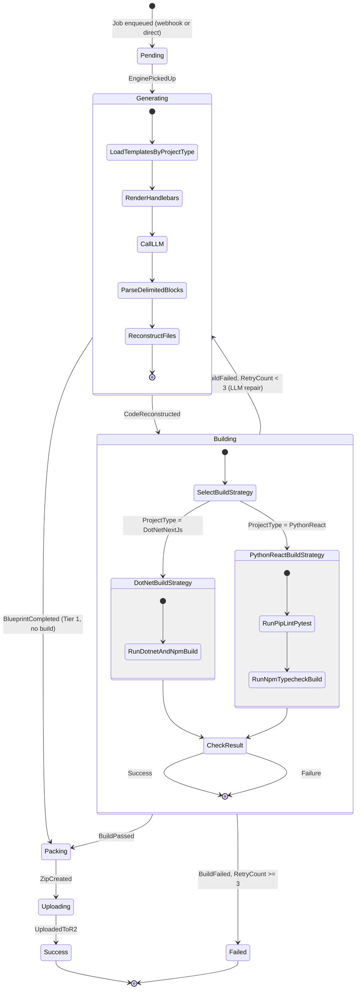

# StackAlchemist: Generation State Machine

This diagram defines the states a generation job can be in, so the status UI and the background workers stay in sync. It mirrors the transition table in `src/StackAlchemist.Engine/Services/GenerationStateMachine.cs`.

```mermaid
stateDiagram-v2
    [*] --> Pending : Job enqueued (webhook or direct)

    Pending --> Generating : EnginePickedUp

    state Generating {
        [*] --> LoadTemplatesByProjectType
        LoadTemplatesByProjectType --> RenderHandlebars
        RenderHandlebars --> CallLLM
        CallLLM --> ParseDelimitedBlocks
        ParseDelimitedBlocks --> ReconstructFiles
        ReconstructFiles --> [*]
    }

    Generating --> Building : CodeReconstructed
    Generating --> Packing : BlueprintCompleted (Tier 1, no build)

    state Building {
        [*] --> SelectBuildStrategy

        SelectBuildStrategy --> DotNetBuildStrategy : ProjectType = DotNetNextJs
        SelectBuildStrategy --> PythonReactBuildStrategy : ProjectType = PythonReact

        state DotNetBuildStrategy {
            [*] --> RunDotnetAndNpmBuild
        }

        state PythonReactBuildStrategy {
            [*] --> RunPipLintPytest
            RunPipLintPytest --> RunNpmTypecheckBuild
        }

        DotNetBuildStrategy --> CheckResult
        PythonReactBuildStrategy --> CheckResult

        CheckResult --> [*] : Success
        CheckResult --> [*] : Failure
    }

    Building --> Packing : BuildPassed
    Building --> Generating : BuildFailed, RetryCount < 3 (LLM repair)
    Building --> Failed : BuildFailed, RetryCount >= 3

    Packing --> Uploading : ZipCreated
    Uploading --> Success : UploadedToR2

    Success --> [*]
    Failed --> [*]
```

### Implementation Reference

The state machine is `GenerationStateMachine.Transition(current, trigger, context)`, a static transition table. Success and Failed are terminal; any transition out of them throws `InvalidStateTransitionException`, as does an undefined (state, event) pair.

**States** (`GenerationState` enum, `Models/GenerationModels.cs`): `Pending`, `Generating`, `Building`, `Packing`, `Uploading`, `Success`, `Failed`

**Events** (`GenerationEvent` enum): `EnginePickedUp`, `CodeReconstructed`, `BlueprintCompleted`, `BuildPassed`, `BuildFailed`, `ZipCreated`, `UploadedToR2`

**Transitions**

| From | Event | To |
|------|-------|----|
| Pending | EnginePickedUp | Generating |
| Generating | CodeReconstructed | Building |
| Generating | BlueprintCompleted | Packing |
| Building | BuildPassed | Packing |
| Building | BuildFailed | Generating if `RetryCount < 3` (increments `RetryCount`), else Failed |
| Packing | ZipCreated | Uploading |
| Uploading | UploadedToR2 | Success |

**Retry loop.** On `BuildFailed` the machine returns `Generating`. `CompileWorkerService` then re-calls the LLM with the error history (using the same credential and model the orchestrator resolved, so BYOK repairs hit the user's provider), writes the corrected files, and fires `CodeReconstructed` to return to `Building`. After 3 repairs the next failure is terminal. On a terminal failure of a paid tier (1-3) the worker issues the Compile Guarantee refund.

**Build strategy selection.** `CompileService` picks `DotNetBuildStrategy` or `PythonReactBuildStrategy` from `ProjectType` on the job context; both plug into the same loop in `CompileWorkerService`.

**Status values in the database.** The `generations.status` column uses a wider vocabulary than the Engine enum: `pending`, `extracting_schema`, `generating_code`, `generating`, `building`, `packing`, `uploading`, `success`, `failed`. `generating` is the build-retry alias of `generating_code`; `extracting_schema` is written during schema extraction, before the Engine state machine starts.
