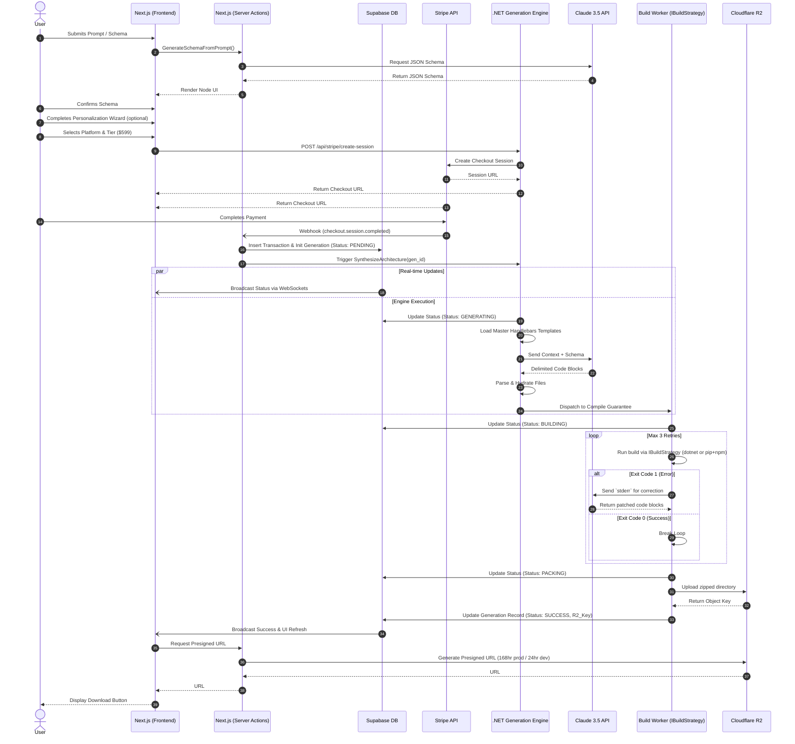

# StackAlchemist: Generation Sequence Diagram

This diagram illustrates the chronological execution of a StackAlchemist generation, including asynchronous Stripe webhooks and real-time WebSocket communication.

