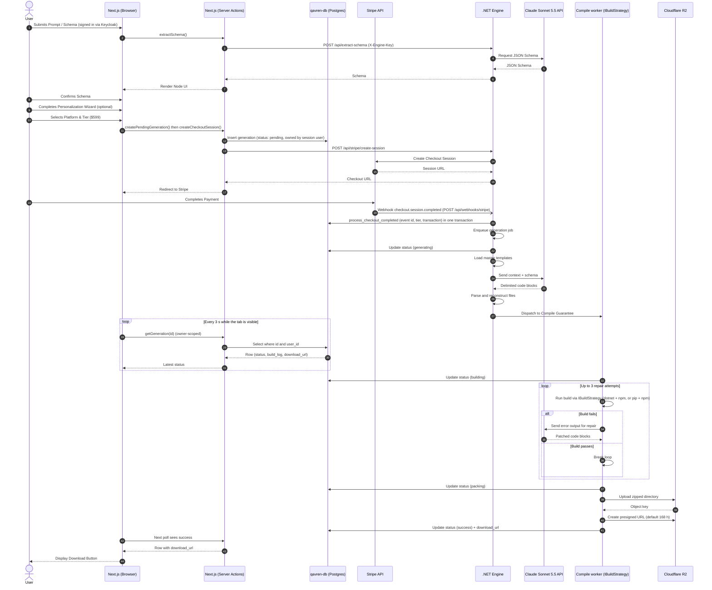

# StackAlchemist: Generation Sequence Diagram

> Updated 2026-10-03. This shows a paid (Boilerplate, $599) generation. Status reaches the browser by polling; there are no WebSockets or Realtime channels.

This diagram illustrates the chronological execution of a StackAlchemist generation, including the asynchronous Stripe webhook and the polling status loop. Spark (Tier 0) skips the Stripe steps: the server action posts straight to the Engine's `/api/generate`.

```mermaid
sequenceDiagram
    autonumber

    actor User
    participant Web as Next.js (Browser)
    participant API as Next.js (Server Actions)
    participant DB as qavren-db (Postgres)
    participant Stripe as Stripe API
    participant Engine as .NET Engine
    participant LLM as Claude Sonnet 5.5 API
    participant Worker as Compile worker (IBuildStrategy)
    participant R2 as Cloudflare R2

    %% INTAKE & CHECKOUT
    User->>Web: Submits Prompt / Schema (signed in via Keycloak)
    Web->>API: extractSchema()
    API->>Engine: POST /api/extract-schema (X-Engine-Key)
    Engine->>LLM: Request JSON Schema
    LLM-->>Engine: JSON Schema
    Engine-->>API: Schema
    API-->>Web: Render Node UI
    User->>Web: Confirms Schema
    User->>Web: Completes Personalization Wizard (optional)
    User->>Web: Selects Platform & Tier ($599)
    Web->>API: createPendingGeneration() then createCheckoutSession()
    API->>DB: Insert generation (status: pending, owned by session user)
    API->>Engine: POST /api/stripe/create-session
    Engine->>Stripe: Create Checkout Session
    Stripe-->>Engine: Session URL
    Engine-->>API: Checkout URL
    API-->>Web: Redirect to Stripe
    User->>Stripe: Completes Payment

    %% ASYNC WEBHOOK & INITIALIZATION
    Stripe-)Engine: Webhook checkout.session.completed (POST /api/webhooks/stripe)
    Engine->>DB: process_checkout_completed (event id, tier, transaction) in one transaction
    Engine->>Engine: Enqueue generation job

    %% GENERATION PROCESS
    Engine->>DB: Update status (generating)
    Engine->>Engine: Load master templates
    Engine->>LLM: Send context + schema
    LLM-->>Engine: Delimited code blocks
    Engine->>Engine: Parse and reconstruct files
    Engine->>Worker: Dispatch to Compile Guarantee

    %% STATUS BY POLLING (runs for the whole job)
    loop Every 3 s while the tab is visible
        Web->>API: getGeneration(id) (owner-scoped)
        API->>DB: Select where id and user_id
        DB-->>API: Row (status, build_log, download_url)
        API-->>Web: Latest status
    end

    %% COMPILE GUARANTEE LOOP
    Worker->>DB: Update status (building)
    loop Up to 3 repair attempts
        Worker->>Worker: Run build via IBuildStrategy (dotnet + npm, or pip + npm)
        alt Build fails
            Worker->>LLM: Send error output for repair
            LLM-->>Worker: Patched code blocks
        else Build passes
            Worker->>Worker: Break loop
        end
    end

    %% PACKING & DELIVERY
    Worker->>DB: Update status (packing)
    Worker->>R2: Upload zipped directory
    R2-->>Worker: Object key
    Worker->>R2: Create presigned URL (default 168 h)
    Worker->>DB: Update status (success) + download_url
    Web->>API: Next poll sees success
    API-->>Web: Row with download_url
    Web-->>User: Display Download Button
```

On a terminal build failure of a paid tier, the worker marks the generation `failed`, issues a full Stripe refund and sends the refund email instead of the packing steps.
